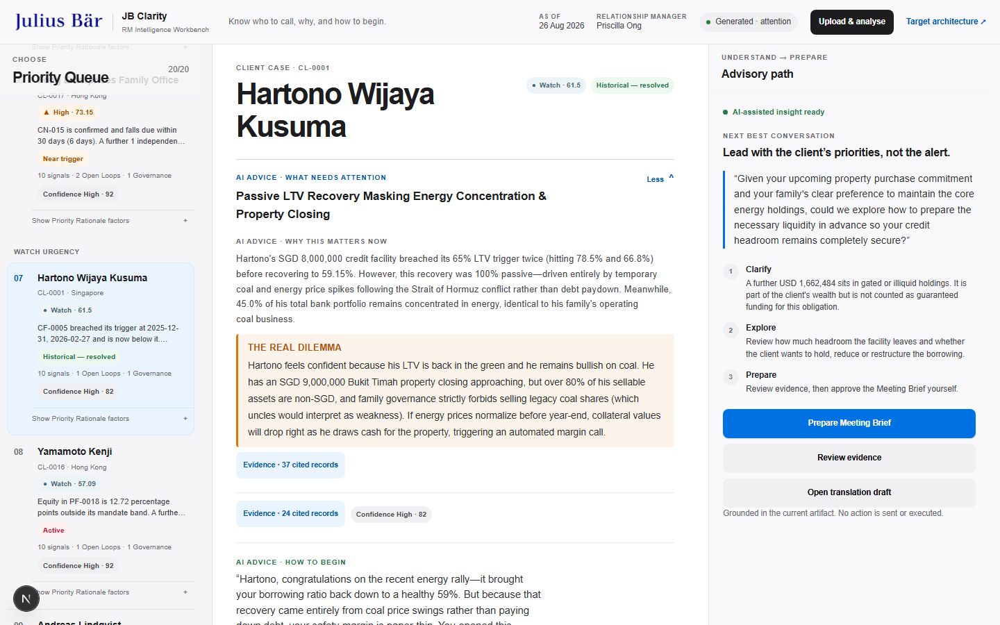
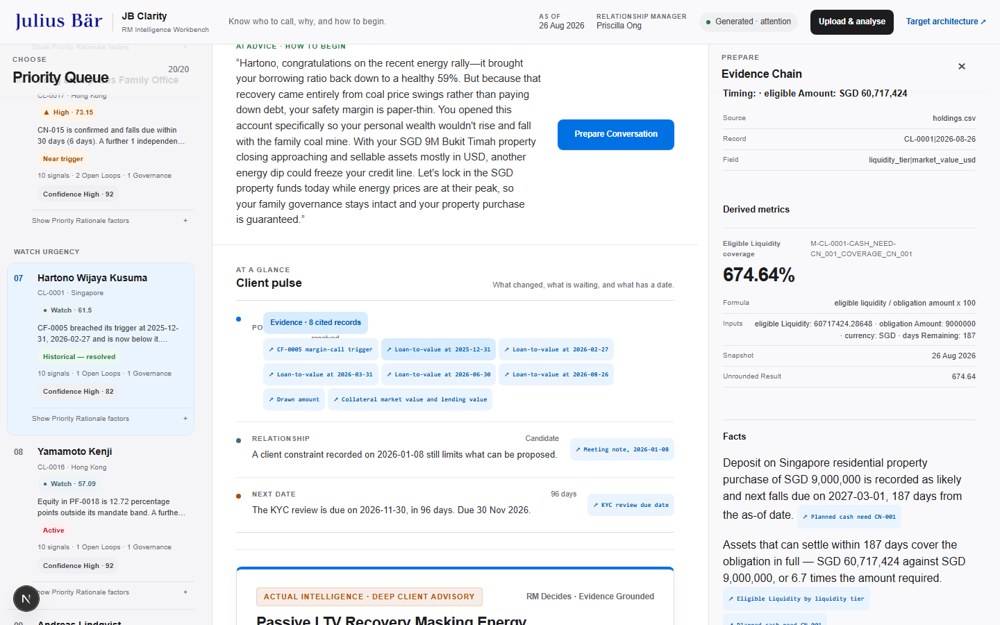
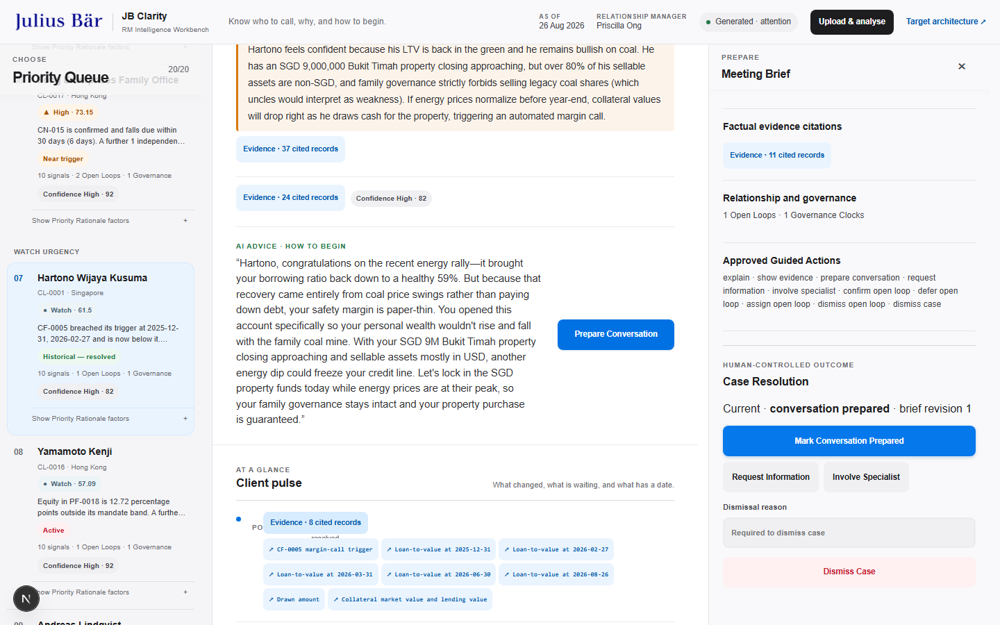

# JB Clarity

> Know who to call, why, and how to begin.

JB Clarity is a wealth intelligence workbench for Relationship Managers. It turns a complex client Book into a clear, evidence-backed plan for the day—without asking the RM to hand judgment over to an AI.

The story starts with Priscilla Ong. She looks after 20 clients across 24 portfolios, with market movements, mandate rules, cash needs, credit facilities, and relationship notes all competing for attention. Traditional portfolio tools show her more data. JB Clarity helps her decide what matters now.



## What the product does

JB Clarity brings four jobs into one calm workflow:

1. **Prioritise the Book.** A deterministic Priority Queue shows which Client Cases need attention first and the visible reasons behind that order.
2. **Understand the client.** Financial signals are combined with objectives, life stage, liquidity needs, and relationship context.
3. **Show the evidence.** Every material claim can be traced through an Evidence Chain to its source record, calculation, or approved event.
4. **Prepare the conversation.** The RM can review, edit, and approve a Meeting Brief and a client-language view. Nothing is sent or traded automatically.

Urgency and Confidence are deliberately separate. A case can be urgent even when some evidence is incomplete, and the uncertainty stays visible instead of being hidden behind a single AI score.

## The three-minute demo

Our live pitch follows one morning in Priscilla’s work:

- **Aishah is ranked first:** a SGD 5.6M mandate breach collides with an AUD 1.45M tuition payment due in six days.
- **Cheung reveals the deeper value:** the system connects his retirement cashflow needs, loss aversion, and a Treasury maturing in 2045 to help Priscilla frame a more human conversation.
- **Evidence earns trust:** source records and deterministic calculations sit behind the insight.
- **Priscilla remains responsible:** she prepares, reviews, and explicitly approves the Meeting Brief.

The full scripts are available in [the roleplay version](web/demo/PITCH-SCRIPT-PRISCILLA-ROLEPLAY.md) and [the three-presenter version](web/demo/PITCH-SCRIPT-3MIN-3PERSON.md).

| Evidence Chain | RM-approved Meeting Brief |
| --- | --- |
|  |  |

## Why it is trustworthy

- **Deterministic where correctness matters.** Python calculates metrics, applies Safety Overrides, and ranks the Book from visible rules.
- **Grounded where language helps.** Optional language generation receives one bounded Evidence Packet at a time and cannot invent new source facts.
- **Human-controlled by design.** The RM can edit, approve, defer, involve a specialist, or dismiss a Client Case with a reason.
- **Safe when offline.** The core demonstration works without a model key or network connection, using validated cached language where available.
- **Honest about uncertainty.** Conflicting sources lower Confidence and remain visible.
- **No autonomous execution.** The prototype has no route for placing a trade or contacting a client.

All client, portfolio, transaction, and RM-note data in this repository is **synthetic and created for the hackathon**. The project still treats it with the care expected of real private-banking data.

## How it works

```text
Synthetic client Book
        ↓
Deterministic intelligence engine
        ↓
Versioned Workbench artifact + Evidence Packets
        ↓
RM Intelligence Workbench
        ↓
Review → Edit → Approve
```

The boundaries are intentional:

| Area | Responsibility |
| --- | --- |
| [`engine/`](engine/) | Data validation, calculations, detectors, Evidence Packets, Urgency, Confidence, and Priority Queue ordering |
| [`contracts/`](contracts/) | Versioned integration contracts shared by the engine and interface |
| [`web/`](web/) | Next.js Command Centre, Client Cases, Evidence Chain, Meeting Brief, upload flow, and demo experience |
| [`control-plane/`](control-plane/) | Separately tested identity, authorization, projection, audit, and approval controls for a target bank environment |
| [`artifacts/`](artifacts/) | Generated Workbench and specialist-intelligence outputs |

The browser presents the artifact; it does not recalculate financial results. The optional language layer explains approved evidence; it does not rank clients or decide what the RM should do.

## Run it locally

You will need Python 3.11 or newer and a recent Node.js/npm installation.

From the repository root:

```bash
python -m venv .venv
source .venv/bin/activate
python -m pip install -e "engine[api,dev]"

cd web
npm ci
npm run dev:full
```

On Windows, activate the environment with `.venv\Scripts\activate` instead. Then open [http://localhost:3000](http://localhost:3000).

Choose **Upload & analyse** to load the supplied canonical CSV/JSON files or a compatible Excel workbook. Gemini is optional; the deterministic intelligence and the complete offline demo do not need an API key.

For a web-only offline demonstration after dependencies are installed:

```bash
cd web
npm run sync-data
npm run build
npm run start
```

## Verify the project

```bash
python -m pytest engine/tests -q
python -m pytest control-plane/tests -q

cd web
npm test
npm run test:e2e
npm run build
```

The test suites cover the financial rules, Evidence Packet integrity, Priority Queue behavior, language validation, security controls, responsive interface, and the complete RM workflow.

## The language we use

These are the canonical terms. They appear in the interface, the code, the
tests and the rest of this README, and they are chosen deliberately: the
_Not:_ line under each one names what that term is specifically **not**, which
is usually where a wealth product quietly starts overclaiming.

**Relationship Manager (RM)** — The bank professional responsible for understanding the client, reviewing evidence, and deciding what advice is appropriate. In this challenge, the RM is Priscilla Ong.
_Not:_ Adviser bot, autonomous adviser.

**Wealth Intelligence Layer** — The capability between portfolio data and the RM that identifies what matters, explains why, anticipates plausible developments, and proposes actions for review.
_Not:_ Portfolio dashboard, robo-adviser.

**Advisory Insight** — A client-specific, actionable finding supported by portfolio data, client context, and traceable assumptions or events. It communicates what changed, why it matters now, and what the RM may consider doing.
_Not:_ Alert, notification, AI answer.

**Evidence Chain** — The inspectable path from source data and approved events through calculations and assumptions to an Advisory Insight.
_Not:_ AI reasoning.

**Controlled Event Source** — The authoritative record used to ground claims about external events. For this challenge, `event_log.csv` overrides model memory about 2026 events.
_Not:_ News feed, model knowledge.

**Advisory Action** — A possible next step that the RM may review, modify, reject, or use to prepare a client conversation. It is not autonomous financial advice.
_Not:_ Automated trade, AI decision.

**Book** — All clients and portfolios for which an RM is responsible. In the challenge dataset, Priscilla's Book contains 20 clients and 24 portfolios.
_Not:_ Portfolio.

**Client Case** — A prioritised bundle of related Advisory Insights about one client that warrants the RM's attention and preparation for a conversation.
_Not:_ Alert, notification.

**Priority Queue** — An ordered view of Client Cases that helps the RM decide whom to contact first and why.
_Not:_ Dashboard, client list.

**Conversation Plan** — An RM-editable preparation brief containing the client-specific explanation, evidence, uncertainties, and possible next steps for discussion.
_Not:_ AI advice, automated recommendation.

**Priority Rationale** — The visible, deterministic reasons a Client Case occupies its position in the Priority Queue, including time urgency, threshold status, client impact, objective mismatch, and relationship signals. Evidence Confidence is displayed separately.
_Not:_ AI score, black-box ranking.

**Evidence Packet** — The bounded set of source records, derived metrics, and approved events supplied to AI for one Client Case. Every generated factual claim must point back to an item in this packet.
_Not:_ Prompt context, entire dataset.

**Evidence Conflict** — A material disagreement between sources that prevents the system from treating a conclusion as settled. It lowers displayed confidence and remains visible to the RM.
_Not:_ Data cleanup, AI reconciliation.

**Urgency** — How soon and how seriously a Client Case requires RM attention, independent of whether all supporting evidence is complete.
_Not:_ Confidence, risk tolerance.

**Confidence** — How strongly the available Evidence Packet supports a Client Case's interpretation. Confidence does not determine whether an urgent case deserves attention.
_Not:_ Urgency, probability of loss.

**Collateral Stress Test** — A transparent what-if calculation showing how a defined change in collateral value would affect a credit facility's loan-to-value ratio and margin-call status.
_Not:_ Market forecast, price prediction.

**Safety Override** — A deterministic condition that assigns a Client Case Critical Urgency regardless of its weighted score because an active breach or imminent unmet obligation requires immediate RM attention.
_Not:_ AI escalation, high score.

**Eligible Liquidity** — Assets realistically available to meet a particular obligation within its required time window, after accounting for liquidity tier, currency, commitments, and known restrictions.
_Not:_ Cash balance, portfolio value.

**Case Resolution** — The RM-recorded outcome of reviewing a Client Case: prepare a conversation, request information, involve a specialist, or dismiss the case with a reason.
_Not:_ Automated action, trade execution.

**Guided Action** — A bounded request the RM can make of the Wealth Intelligence Layer, such as explaining a case, showing its evidence, or preparing a Conversation Plan.
_Not:_ Open-ended chat, autonomous agent.

**Client-Ready View** — An RM-reviewed rendering of a Conversation Plan in the client's preferred reporting language, shown alongside the canonical internal version with unchanged figures and evidence references.
_Not:_ Raw translation, autonomous client message.

**Anticipatory Signal** — A source-cited indication that a client is likely to encounter a material financial or governance issue soon, before the client raises it with the RM.
_Not:_ Alert spam, market prediction.

**Open Loop** — An unresolved client question, commitment, or repeated discussion evidenced in RM notes and awaiting RM confirmation, resolution, deferral, or assignment.
_Not:_ Fact, AI task.

**Meeting Brief** — An RM-facing preparation view that combines a Client Case's timely issue, Evidence Chain, Open Loops, preferred language, questions to ask, and possible next steps.
_Not:_ Client report, automated outreach.

**Governance Clock** — The time-sensitive compliance and administrative obligations relevant to a Client Case, including a KYC review that is due soon or overdue.
_Not:_ Overdue KYC when it is only due soon.

### Working agreements

Use these terms in interfaces, tests and UI copy. Where evidence conflicts with
a recorded decision in `docs/adr/`, surface the conflict rather than silently
overriding it: a disagreement the data actually contains is a finding, not a
defect to smooth away.

`docs/SPEC.md` is the behavioural source of truth. The briefs that commissioned
each slice are archived in `docs/briefs/`, and what each slice delivered is
recorded in `docs/handoff/`.

## Learn more

- [Intelligence engine](engine/README.md)
- [RM workbench](web/README.md)
- [Multi-agent intelligence architecture](docs/architecture/multi-agent-intelligence.md)
- [Threat model](docs/THREAT-MODEL.md)
- [Challenge dataset and data dictionary](singhacks-jb-wealth-intelligence/README.md)
- [Behavioural specification](docs/SPEC.md), the [briefs](docs/briefs/) that commissioned each slice, and the [handoffs](docs/handoff/) recording what each delivered

This repository is a personal fork. `origin` is `YXY4NG/SINGHACKS-AAActual-Intelligence`; `upstream` is the shared team repository `realjunjiejj/singhack`.

JB Clarity is not trying to replace the Relationship Manager. It is designed to make every client conversation more timely, more defensible, and more human.
